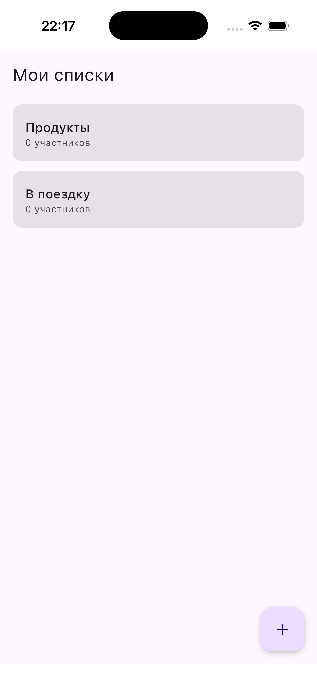

# Lists App — Design System

> Обязательный файл для ui-ux-designer агента.
> Прочитай **перед любой дизайн-работой** в этом проекте.
> Скриншоты реального приложения: `docks/screenshots/`

---

## Реальный UI (из симулятора)

### Экран «Мои списки»


**Что видно:**
- Фон: очень светлый лавандово-белый (не чисто белый, с фиолетовым оттенком)
- TopAppBar: крупный заголовок «Мои списки», без elevation, сливается с фоном
- Карточки: светло-серые с лавандовым оттенком, большие скругления, **без тени и обводки**
- Карточка содержит: название (medium weight) + «0 участников» (серый, мелкий)
- FAB: скруглённый квадрат, мягкий лавандовый фон, тёмно-индиговый «+»
- Между карточками — только отступ, **без divider**

---

## Цветовая палитра (из Theme.kt)

```
primary:            #4052B5  (индиго)
onPrimary:          #FFFFFF
primaryContainer:   #DDE1FF  (светло-индиго)
onPrimaryContainer: #000F60

secondary:          #5C6BC0
secondaryContainer: #E8EAF6
onSecondaryContainer:#1A237E

background:         #F8F9FF  (очень светлый лавандово-белый)
surface:            #F8F9FF
onBackground:       #1B1B21
onSurface:          #1B1B21

surfaceVariant:     #E3E1EC  (светло-серый с лавандой — цвет карточек)
onSurfaceVariant:   #46464F  (серый текст)

outline:            #777680
outlineVariant:     #C7C5D0

error:              #BA1A1A
errorContainer:     #FFDAD6
onErrorContainer:   #410002
```

**Важно:** Тема **только светлая** (`lightColorScheme`). Тёмной темы нет.

---

## Типографика

Material 3 типографика по умолчанию (без кастомных шрифтов в коде).

| Стиль | Использование |
|-------|--------------|
| `titleLarge` | Заголовок TopAppBar |
| `titleMedium` + SemiBold | Название списка в карточке |
| `bodyLarge` | Текст пункта в ItemRow |
| `bodySmall` | Тип списка / количество / secondary info |
| `labelSmall` | «→ Маша» (кто взял) — primary color |
| `labelMedium` | Подписи к фильтрам |

---

## Компоненты

### ListCard (экран списков)
```
Card(
  shape = RoundedCornerShape(16.dp),
  color = surface (#F8F9FF),       ← в коде surface, но визуально серее
  elevation = 2.dp,
  margin = horizontal:16dp, vertical:6dp
)
Row(padding=16dp):
  [пусто — в коде есть emoji box, но в реальном UI не отображается заметно]
  Column:
    Text(title, titleMedium, SemiBold)
    Text(type.label(), bodySmall, primary color #4052B5)
```

**Реальный вид:** карточка серовато-лавандовая, название жирное, подзаголовок синий/серый

---

### ItemRow (экран деталей)
```
Row(padding = horizontal:16dp, vertical:4dp, verticalAlignment = CenterVertically):
  Checkbox(checked = isDone)                    ← слева
  Column(weight=1f, padding=horizontal:8dp):
    Text(title, bodyLarge, strikethrough if done)
    Text(quantity, bodySmall, onSurfaceVariant)  ← если есть
    Text("→ name", labelSmall, primary)          ← если взят
  TextButton("Взять")  или  TextButton("Снять")  ← крайний справа, только если не done
HorizontalDivider()                              ← после каждой строки
```

**Важно:** TextButton всегда самый правый элемент Row, **вне** Column.
Если пункт взят другим — кнопки нет совсем.

---

### FAB
```
FloatingActionButton(onClick = ...):
  Icon(Icons.Default.Add)
```
Визуально: скруглённый квадрат, цвет `primaryContainer` (#DDE1FF), иконка `primary` (#4052B5)

---

### FilterChip (фильтр «Все / Мои»)
```
FilterChip(selected = ..., label = { Text("Все") })
FilterChip(selected = ..., label = { Text("Мои") })
```
Расположены горизонтально под TopAppBar, отступ 8dp между ними.

---

### AlertDialog (диалоги создания)
Стандартный Material 3 `AlertDialog`:
- Заголовок: «Новый список» / «Новый пункт»
- `OutlinedTextField` для названия
- `TextButton` «Создать» / «Отмена»
- В «Новый список»: `FilterChip` для выбора типа (FlowRow)
- В «Новый пункт»: `SuggestionChip` горизонтально (LazyRow)

---

### TopAppBar (детали списка)
```
TopAppBar:
  navigationIcon: IconButton(ArrowBack или Close при поиске)
  title: Text(listTitle) или BasicTextField при поиске
  actions:
    IconButton(Search)
    IconButton(Share)
    IconButton(MoreVert) → DropdownMenu
```

---

### ModalBottomSheet (участники)
Стандартный Material 3. Заголовок «Участники», список имён через `ListItem`.

---

## Навигация

State-based, без библиотек:
```
Screen.Lists       → главный экран
Screen.ListDetail  → детали списка
```
Переходы через `when(screen)` в `App.kt`.

---

## Типы списков и их обозначения

| Тип | Эмодзи | Ярлык |
|-----|--------|-------|
| SHOPPING | 🛒 | Покупки |
| TRAVEL | 🧳 | Поездка |
| EVENT | 🎉 | Мероприятие |
| MOVING | 📦 | Переезд |
| GENERAL | ✅ | Общий |

Эмодзи используются только в диалоге создания списка (FilterChip) и в карточке списка.

---

## Принципы дизайна приложения

1. **Минимализм** — никаких лишних декораций, теней, градиентов
2. **Material 3** — строго следовать компонентам M3, не изобретать своё
3. **Светлая тема** — только light, никакого dark mode пока нет
4. **Индиго как акцент** — primary #4052B5 для кнопок, ссылок, активных элементов
5. **Лавандовый фон** — #F8F9FF даёт мягкий purple-tint, не чисто белый
6. **Русский язык** — все UI-тексты на русском
7. **Компактность** — приложение для бытового использования, не B2B

---

## Чего НЕ делать

- ❌ Тёмные фоны, градиенты, «AI-look»
- ❌ Кастомные цвета вне палитры Theme.kt
- ❌ Кастомные шрифты (только системный)
- ❌ Анимации сложнее Material 3 стандартных
- ❌ Эмодзи как декоративные элементы (только функциональные — тип списка)
- ❌ Тени сильнее elevation=2dp
- ❌ Любые компоненты не из Material 3

---

## Скриншоты

| Файл | Экран |
|------|-------|
| `screenshots/01-lists-screen.png` | Главный экран «Мои списки» |

> Когда будут сняты дополнительные скриншоты — они появятся в `screenshots/`
